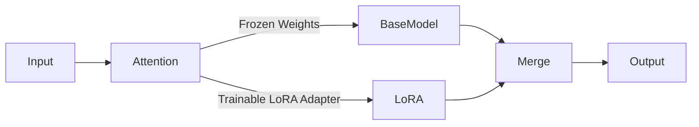
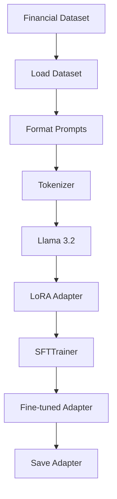

# Financial Advisor LLM using LoRA Fine-Tuning

An end-to-end implementation of a **Financial Advisor Large Language Model (LLM)** built by fine-tuning **Llama 3.2** using **LoRA (Low-Rank Adaptation)**. The project demonstrates how domain-specific instruction tuning can be used to create an AI assistant capable of providing personalized financial guidance, budgeting suggestions, investment education, and risk assessment.

---

##  Features

- Fine-tune Llama 3.2 using LoRA
- Parameter-efficient training using PEFT
- Instruction tuning on financial conversations
- Budget planning assistance
- Financial goal planning
- Risk profiling
- Portfolio allocation suggestions
- Adapter-based inference
- Easily extendable with RAG and Tool Calling

---

# Project Architecture


---

# LoRA Fine-Tuning Architecture

Instead of updating all billions of parameters, LoRA injects trainable low-rank matrices into the attention layers.



Only the LoRA adapter weights are updated during training, making fine-tuning significantly more memory-efficient.

---

# Project Structure

```
financial-advisor-llm/
│
├── configs/
│   └── lora_config.yaml
│
├── data/
│   └── train.jsonl
│
├── src/
│   ├── train.py
│   ├── inference.py
│   └── app.py
│
├── requirements.txt
└── README.md
```

---

# Training Pipeline



---

# Dataset Format

Training examples are stored in JSONL format.

Example:

```json
{
  "instruction":"Suggest a budget",
  "input":"Income=80000, Goal=Emergency Fund",
  "output":"Allocate 50% needs, 30% savings..."
}
```

Each training sample consists of:

- instruction
- input
- output

---

# Prompt Template

The dataset is converted into the following instruction format:

```
### Instruction

Suggest a budget

### Input

Income = ₹80,000

### Response

Allocate...
```

---

# Installation

Clone the repository

```bash
git clone <repo-url>

cd financial-advisor-llm
```

Install dependencies

```bash
pip install -r requirements.txt
```

---

# Training

Run

```bash
python src/train.py
```

Training performs

- Loads Llama 3.2
- Loads dataset
- Formats prompts
- Applies LoRA adapters
- Fine-tunes using TRL SFTTrainer
- Saves the trained adapter

Output directory

```
financial-advisor-lora/
```

---

# Inference

Run

```bash
python src/inference.py
```

Example query

```
I earn ₹80,000/month.

Help me create a budget.
```

Expected output

```
Suggested budget

Emergency fund recommendation

Savings advice

Investment guidance
```

---

# Configuration

LoRA configuration

```yaml
Model:
meta-llama/Llama-3.2-3B-Instruct

Rank: 16

Alpha: 32

Dropout: 0.05

Learning Rate:
2e-4

Epochs:
2
```

---

# Technologies Used

- Python
- PyTorch
- Hugging Face Transformers
- PEFT
- TRL
- LoRA
- Llama 3.2
- Accelerate
- BitsAndBytes
- Streamlit

---

# Current Capabilities

The model can provide guidance on

- Budget planning
- Savings strategies
- Investment education
- Financial goal planning
- Basic portfolio allocation
- Risk profiling

---

# Disclaimer

This project is intended solely for educational and research purposes. The generated responses are not financial, investment, tax, or legal advice. Users should consult qualified financial professionals before making financial decisions.
